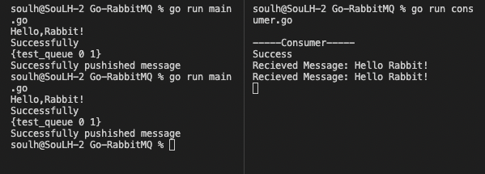

# Go-RabbitMQ

### Starting (M1-ARM64)

```
Install RabbitMQ Docker

cd ./docker_Container
docker-compose up

```

```
Start Publisher - send Message

go run main.go

```


```
Reading Message

go run consumer.go
```


<p>
    

</p>


####    Thank You TutorialEdge